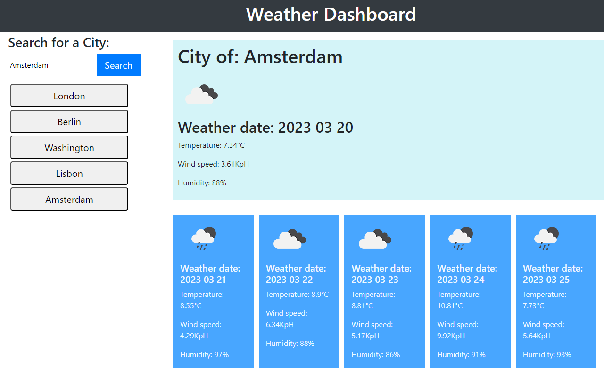

# Weather Dashboard
  # <Your-Project-Title>

  ## Description
  
  - Server APIs allow developers to access their data and functionality by making requests with specific parameters to a URL;
  - Developers are often tasked with retrieving data from another application's API and using it in the context of their own;
  - The app is a weather dashboard that will run in the browser and feature dynamic updates;
  - The app retrieves weather data for cities.
  

  ## Table of Contents (Optional)
    
  - [Installation](#installation)
  - [Usage](#usage)
  - [License](#license)
  - [Credits](#credits)

  

  ## Installation
  
  N/A.
  

  ## Usage
  
  * When a user searches for a city they are presented with current and future conditions for that city and that city is added to the search history
  * When a user views the current weather conditions for that city they are presented with:
    * The city name
    * The date
    * An icon representation of weather conditions
    * The temperature
    * The humidity
    * The wind speed
  * When a user view future weather conditions for that city they are presented with a 5-day forecast that displays:
    * The date
    * An icon representation of weather conditions
    * The temperature
    * The humidity
  * When a user click on a city in the search history they are again presented with current and future conditions for that city

  
  
  Link to deployed App [Duck Duck Go](https://decomacie.github.io/Weather_Dashboard/). 
  
  
  ## License
  
  MIT  

  ## Credits
  
  ### Collaborators
  
  N/A
    
  ### Tutorials
  N/A
  
  ---
  
  🏆 
  

  ## Questions
  For additional questions please reach me on 
  - Email: bulazhi@gmail.com.
  - GitHub: DecoMacie.

